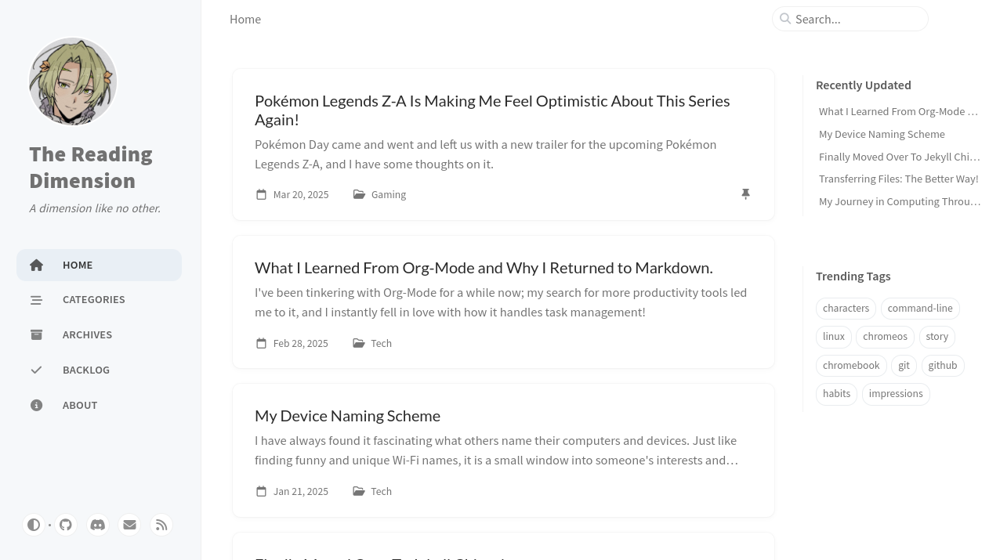

# The Reading Dimension

## Introduction

This is my small humble digital garden that started out as a blog, I mostly muse about tech-related subjects but I also dabble in gaming, anime, manga and writing as well.

## The Site

I started this project about two years now and my site, now a digital garden has evolved every step of the way! I'm currently really happy with its current shape and I'm slowly adding more features when I have the spare time.

## Tech Stack

1. **Static Site Generator**: [Jekyll](https://jekyllrb.com/) v4.4.1

   - I've been using Jekyll since the beginning and I'm not planning to move anytime soon! I really want to master Jekyll before I use other frameworks in earnest and Jekyll works for my needs. If it ain't broke don't fix it as the saying goes

2. **Jekyll Theme**: [Jekyll Chirpy](https://github.com/cotes2020/jekyll-theme-chirpy) v7.2.4

   - I recently moved over to this theme from minima, As minima didn't have the features I wanted for a digital garden moving foward. This one meets my needs and the design is minimalistic and clean just how I like it. In the future I will probably make my own custom theme but for now I'm quite happy with it.

3. **Git Host**: [GitHub](https://github.com/)

   - As you can see I'm using GitHub to host my repository, its integration with CloudlFlare Pages makes deoploying my site effortless.

4. **Web Hosting**: [CloudFlare Pages](https://pages.cloudflare.com/)

   - I take advantage of the generous free plan to host my site. I used to use GitHub Pages but it had limitations that made it harder to use new versions of Jekyll and its themes.

5. **Analytics**: [Tinylytics](https://tinylytics.app/)

   - I don't need or want every feature most analytics prividers offer, I'm just a bit curious to see what people are interested in and I really like that idea of webrings and kudos.

6. **Development Environment**: [Visual Studio Code Web](https://vscode.dev/) and [GitHub Codespaces](https://github.com/features/codespaces)

   - For writing posts I use the web version of VS Code. It offers a handy PWA and works natively on my Chromebook. It's built in Git integration is handy as well. As for testing locally before deploying I use GitHub Codespaces to spin up a machine well suited for that task.

## Roadmap

Features I like to add to my site over time, from different pages to small features.

1. New pages.

   - [ ] Uses `/uses/`.
   - [ ] Changelog `/changelog/`.
   - [ ] Now `/now/`.
   - [ ] Links `/links/`.
   - [ ] Notes `/notes/`.
   - [ ] Micro `/micro/`.
   - [ ] Blogroll `/blogroll/`.
   - [x] Backlog `/backlog/`.

     - [ ] Revamp  

   - [ ] Guestbook `/guestbook/`.

2. New Features

   - [ ] New logo.
   - [ ] Adding a h-card.
   - [ ] Adding Kudos.
   - [ ] Add a Commit tag in the Footer.

---

So what do you think? I'll love to hear your feedback! Send me a email or get in contact with over Discord! ʕ·ᴥ·ʔ
